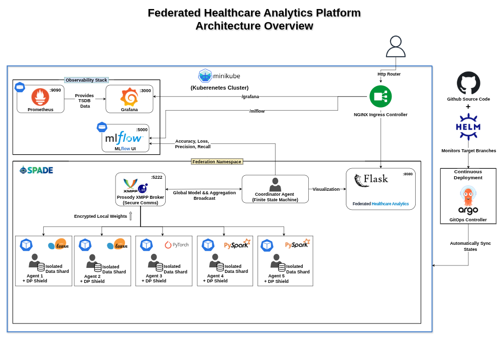

# Federated Healthcare Analytics Platform

<div align="center">
  
</div>

<p align="center">
  
  
  
  
  
  
  
  
  
  
  
  
</p>

## Overview

The **Federated Healthcare Analytics Platform** is a cloud-native, distributed medical system designed to enable multiple autonomous hospitals (agents) to collaboratively train diagnostic models without sharing underlying raw patient records. By utilizing Federated Learning (Federated Averaging), strict Differential Privacy (DP), and secure message brokering, this platform ensures mathematically bounded clinical data privacy while achieving high predictive performance.

The platform collaboratively trains models on real-world datasets such as the **Breast Cancer Wisconsin (Diagnostic) Dataset** and **Pneumonia X-Ray Images**.

Repository: [Privacy-Preserving-Multi-Agent-Data-Platform](git@github.com:MedGm/Privacy-Preserving-Multi-Agent-Data-Platform.git)

## Cloud-Native Architecture

The system has been modernized from a local Docker Compose setup to a highly resilient, **GitOps-driven Kubernetes architecture**.

1.  **GitOps Deployment (ArgoCD & Helm)**: The entire infrastructure is declared via Helm charts (`helm/federation/`). ArgoCD continuously monitors the main branch and automatically syncs the live Kubernetes state with the manifest definitions.
2.  **Coordinator Agent (StatefulSet)**: The central orchestration node running a Finite State Machine (FSM). It manages agent registration, dictates round synchronization, computes the weighted Federated Average of agent models, and broadcasts the updated global model.
3.  **Training Agents (Deployments)**:
    *   **PyTorch Agents**: Deep learning nodes executing Federated Learning on image datasets (e.g., Pneumonia X-Rays) using PyTorch neural networks.
    *   **Standard Agents (scikit-learn)**: Compute nodes executing strictly isolated local training over real-world clinical tabular datasets.
    *   **Big Data Agents (PySpark)**: Enterprise-grade compute nodes utilizing PySpark DataFrames for distributed processing of local models.
4.  **XMPP Message Broker**: A Prosody server orchestrating asynchronous, secure communication protocols between the Coordinator and all computing Agents via the SPADE framework.
5.  **Observability Stack**: 
    *   **Prometheus**: Scrapes time-series metrics from the Coordinator node at the `/metrics` endpoint.
    *   **Grafana**: Visualizes Prometheus data into real-time operational dashboards (via provisioned ConfigMaps).
    *   **MLflow Tracker**: A centralized logging server capturing the overarching federation hyperparameters (target rounds, Quorum count, DP limits) and tracking individual hospital AI metrics (Accuracy, Loss, Precision, Recall).
    *   **Flask UI Dashboards**: A live clinical interface showing real-time network states and controlling federation rounds.
    *   **Nginx Ingress Controller**: Manages routing into the cluster (`pmad.local/`, `/grafana`, `/mlflow`).

## Federated Workflow

The execution lifecycle follows a strictly orchestrated loop managed by the Coordinator's FSM:

1.  **Idle & Heartbeats**: The Coordinator boots and waits in an `IdleState`. Agents boot independently and send periodic `JOIN` heartbeats to ensure discovery.
2.  **Start Request**: A user submits a Start command and target rounds via the Flask Dashboard.
3.  **Round Synchronization**: The Coordinator signals the beginning of a training round, broadcasting the latest global models for all active tasks (e.g., Breast Cancer, Pneumonia X-Ray).
4.  **Local Computation (Isolated)**:
    *   Agents receive the broadcast and train locally using scikit-learn, PyTorch, or PySpark on their siloed data splits.
    *   Agents enforce local Differential Privacy via weight clipping and Laplace/Gaussian noise injection.
5.  **Aggregation**: The Coordinator calculates a weighted Global Average (FedAvg) of the gradients for each task. It logs metrics to MLflow and exposes them to Prometheus.
6.  **Loop or Terminate**: If the `Target Rounds` are met, the FSM saves the final models and returns to `IdleState`. Otherwise, it loops back to Step 3.

## Prerequisites

*   **Minikube** (or any Kubernetes cluster)
*   **kubectl**
*   **Helm** (v3+)
*   **ArgoCD CLI** (optional, but recommended)

## Deployment & Execution (GitOps flow)

1.  **Start Minikube & Enable Addons:**
    ```bash
    minikube start --cpus=4 --memory=8192
    minikube addons enable ingress
    ```

2. **Deploy ArgoCD:**
    ```bash
    kubectl create namespace argocd
    kubectl apply -n argocd -f https://raw.githubusercontent.com/argoproj/argo-cd/stable/manifests/install.yaml
    ```

3. **Apply the Federation Application:**
    ```bash
    kubectl apply -f argocd/application.yaml
    ```
    *ArgoCD will automatically pull the Helm charts and deploy the entire stack.*

4. **Access the Web Interfaces:**
    If you have `pmad.local` mapped in your `/etc/hosts` to the Minikube IP (`minikube ip`), or by using port-forwarding:
    
    *   **Global Control Dashboard**: `http://localhost:8080/`
    *   **Grafana Dashboards**: `http://localhost:3000/` (admin / federation)
    *   **MLflow Metrics Tracker**: `http://localhost:5000/`

5.  **Run a Federation:**
    *   Open the Global Dashboard.
    *   Input the desired number of `Target Rounds`.
    *   Click **Start Federation**.
    *   Monitor the structural convergence via MLflow or the real-time operational state via Grafana!

## Configuration Parameters

You can manipulate the federation behavior via the `helm/federation/values.yaml` file:

| Variable | Target | Description | Default |
| :--- | :--- | :--- | :--- |
| `coordinator.replicaCount` | Coordinator | Must be 1 (Stateful synchronization) | 1 |
| `agents.sklearn.replicaCount` | Agents | Number of scikit-learn Tabular agents | 2 |
| `agents.pytorch.replicaCount` | Agents | Number of PyTorch DL agents | 1 |
| `agents.spark.replicaCount` | Agents | Number of PySpark DataFrame agents | 2 |
| `xmpp.image.tag` | All | Specifies the exact Prosody broker version | latest |
